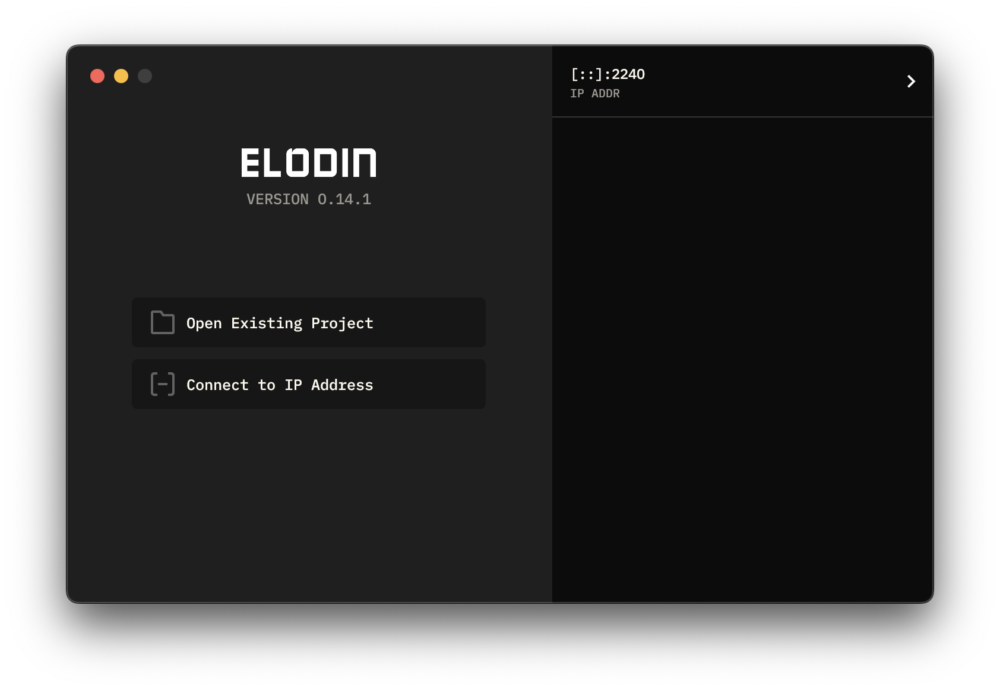
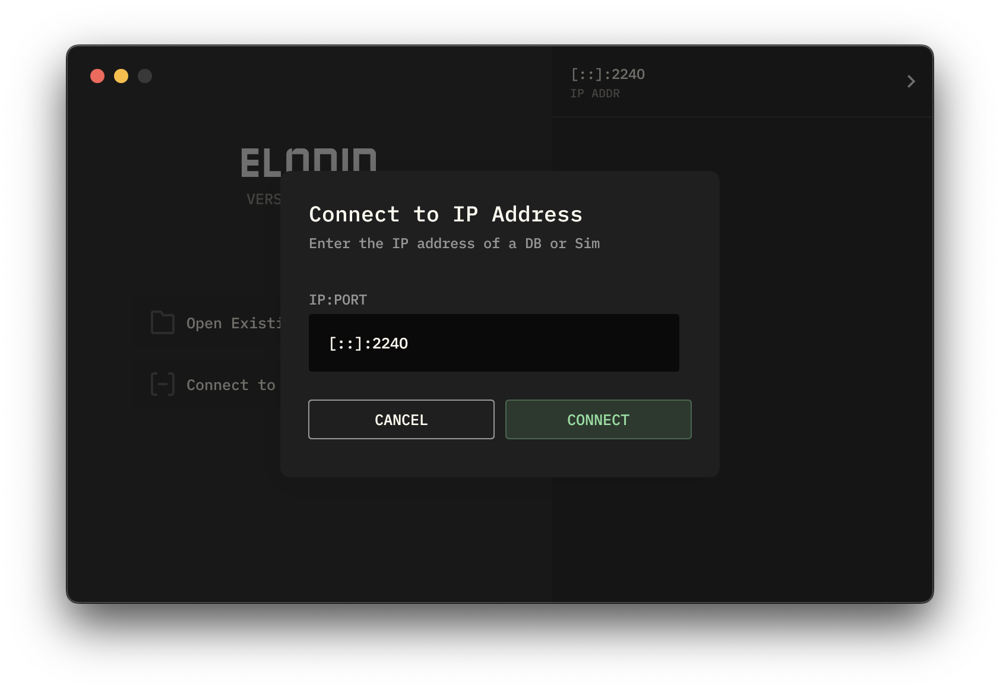
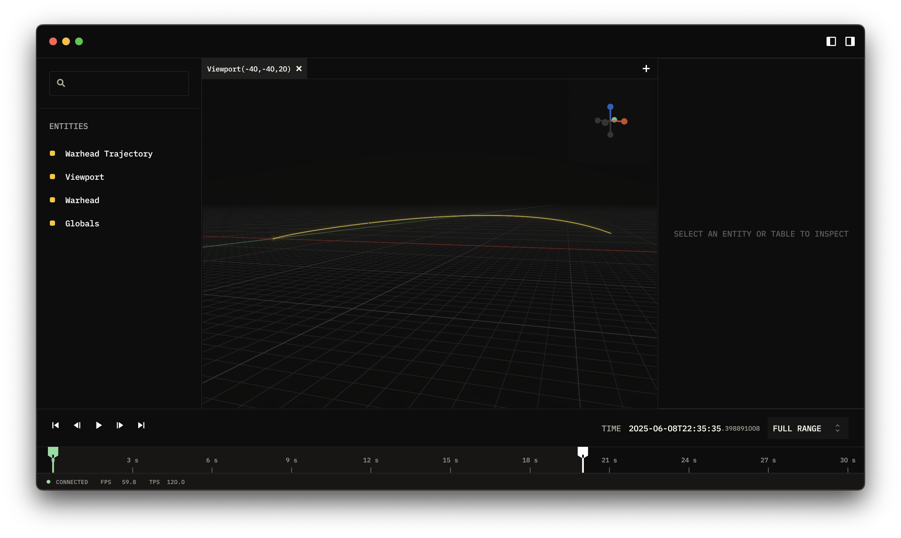

# SDC

SD Challenge

## Quick Start

1. Make sure you have at least Python 3.12 installed.
2. Run `pip install -e .` and it will automatically install the required Python dependencies.
3. Download and install [Elodin Client](https://docs.elodin.systems/home/quickstart/)
4. After the installation, use `sdc run` command to run the simulation server.

### Using the Client

You would need to run the [Elodin Client](https://docs.elodin.systems/home/quickstart/) to access to the simulation server.
When you run the [Elodin Client](https://docs.elodin.systems/home/quickstart/), you would see the following screen:

Click on __Connect to IP Address__ button and use the default option to connect to the simulation server:

You would see an output like this:

## More Information

* [RFD Document](README_RFD.md)
